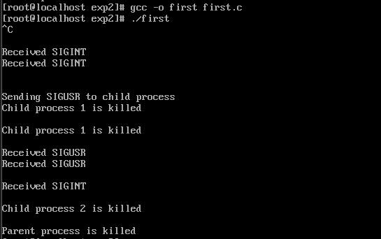
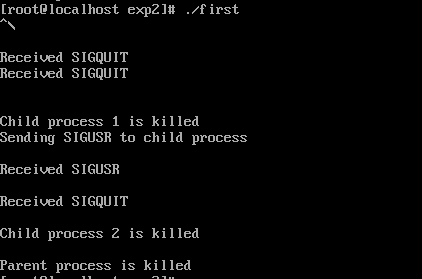
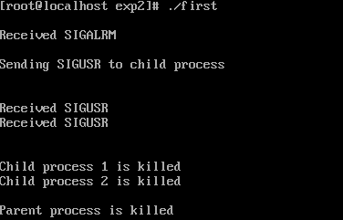
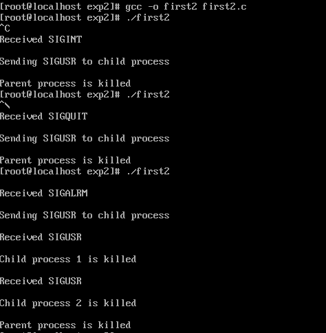
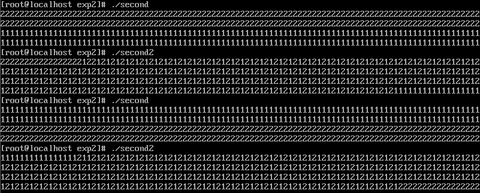
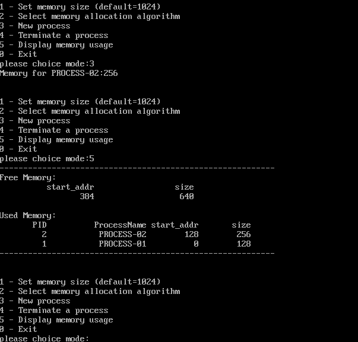

# 第二次实验
## OpenEuler本地环境搭建
本身配置系统并不复杂，大致步骤为：
- 安装VMWare
- 下载OpenEuler对应版本iso文件
- 在VMWare创建虚拟机
- 按照引导安装系统
- 安装一些必备的包，包括tar, gcc, g++, vim, tree等待，不具体列举

### 过程中遇到的问题：
1. 创建的虚拟机无法打开，无法加载系统安装引导
   - 解决方式：提高分配给虚拟机的内存空间，建议最低4G
2. 安装好后无法输入用户名进行登录
    - 解决方式：不明原因，删除系统并重新安装后解决
3. 无法与主机共享文件、剪贴板等内容
   - 尝试了多种方式，包括使用VMWare tools，使用vscode ssh远程连接，使用FinalShell 远程连接，使用vsftpd。但每种方式都会报错，报错类型较多，没有查找到很好的解决方式。此部分网上有一些教程资源，可以根据具体的方式搜索教程。
   - 此问题耗时较久，大约有四到五个小时在解决此问题，影响实验进度。
   - 最终VMWare tools问题解决，解决方式为：删除之前的vmtools文件，重新安装。参考https://blog.csdn.net/XiaoYan8023/article/details/101576209
  ```
  cd /usr/lib
rm -r vmware-tools
cd /etc
rm -r vmware-tools
  ```
## 进程的软中断通信
本实验主要目的为掌握进程间通过信号量进行通信的方式，研究常见的信号量及其使用方式，包括sleep, pause, fork, signal等。 
代码：
```
#include <stdio.h>
#include <unistd.h>
#include <sys/wait.h>
#include <stdlib.h>
#include <signal.h>

int flag = 0;
void interrupt_handler(int signo){
	if (signo == SIGINT){
		printf("\nReceived SIGINT\n");
		flag = 1;
	}
	else if (signo == SIGQUIT){
		printf("\nReceived SIGQUIT\n");
		flag = 2;
	}
	else if (signo == SIGUSR1 || signo == SIGUSR2){
		printf("\nReceived SIGUSR\n");
		flag = 3;
	}
	else
		printf("\nReceived SIGALRM\n");
		flag = 4;
}

void waiting(){
	sleep(5);
}

int main(){
	pid_t pid1 = -1, pid2 = -1;
	signal(SIGINT, interrupt_handler);
	signal(SIGQUIT, interrupt_handler);
	signal(SIGALRM, interrupt_handler);
	alarm(5);
	while (pid1 == -1)
		pid1 = fork();
	if (pid1 > 0){
		while(pid2 == -1) 
			pid2 = fork();
		if(pid2 > 0){
			signal(SIGINT, interrupt_handler);
			signal(SIGQUIT, interrupt_handler);
//			signal(SIGALRM, interrupt_handler);
			waiting();
			printf("\nSending SIGUSR to child process\n");
			kill(pid1, SIGUSR1);
			kill(pid2, SIGUSR2);
			wait(NULL);
			wait(NULL);
			printf("\nParent process is killed\n");
		}
		else{
			signal(SIGUSR2, interrupt_handler);
			pause();
			if(flag == 3)
				printf("\nChild process 2 is killed by parent\n");
			else
				printf("\nChild process 2 is killed\n");
			exit(0);
		}
	}
	else{
		signal(SIGUSR1, interrupt_handler);
		pause();
		if (flag == 3)
			printf("\nChild process 1 is killed by parent\n");
		else
			printf("\nChild process 1 is killed\n");	
		exit(0);
	}
	return 0;
}
```
输出结果为：



### 过程中遇到的问题：
我选择的阻塞子进程的方式为pause以等待信号量（也可以使用while循环判断flag值等方式），这样会遇到一个问题：当使用signal监听多个信号量时，子进程会检测到SIGNINT信号时便直接终止，而不会等待父进程发送到kill信号。如果只让父进程接收kill信号，子进程会被杀死，但没有输出：


## 进程间管道通信
主要目的为编程实现进程的管道通信，主要为命名管道。通过观察、分析实验现象，深入理解进程管道通信的特点，
掌握管道通信的同步和互斥机制。

代码为：
```
#include <stdio.h>
#include <unistd.h>
#include <sys/wait.h>
#include <stdlib.h>
#include <signal.h>

pid_t pid1, pid2;

int main(){
	int fd[2];
	char inpipe[10000];
	char c1 = '1', c2 = '2';
	pipe(fd);

	while((pid1 = fork()) == -1);
	if(pid1 == 0){
		close(fd[0]);
		lockf(fd[1], 1, 0);
		for(int i = 0;i < 200; i++){
			write(fd[1], &c1, 1);
		}
		sleep(5);
		lockf(fd[1], 0, 0);
		close(fd[1]);
		exit(0);
	}
	else{
		while((pid2 = fork()) == -1);
		if(pid2 == 0){
			close(fd[0]);
			lockf(fd[1], 1, 0);
			for(int i = 0; i < 200; i++){
				write(fd[1], &c2, 1);
			}
			sleep(5);
			lockf(fd[1], 0, 0);
			close(fd[1]);
			exit(0);
		}
		else{
			close(fd[1]);
			wait(0);
			wait(0);
			ssize_t bytesRead = read(fd[0], inpipe, 400);
			inpipe[bytesRead] = '\0';
			printf("%s\n", inpipe);
			close(fd[0]);
			exit(0);
		}
	}
	
	return 0;
}
```
代码中两个子进程用于写入管道，父进程用于写出管道，为两个子进程添加了互斥锁，保证不会出现交错写入。加锁与不加锁的输出分别为：



## 内存的分配与回收

通过设计实现内存分配管理的三种算法（FF，BF，WF），实现一个小的内存分配模拟程序，理解内存分配及回收的过程及实现思路，理解如何提高内存的分配效率和利用率。

代码如下：
```
third.c
```

输出结果情况较多，需要动态演示
